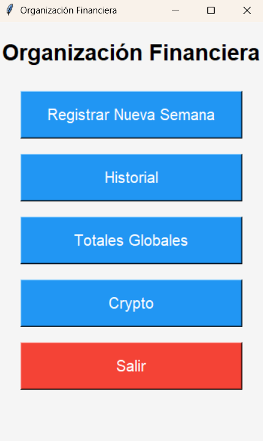
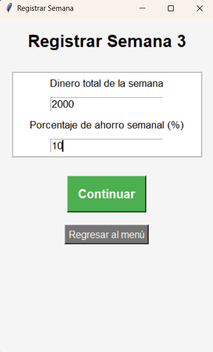
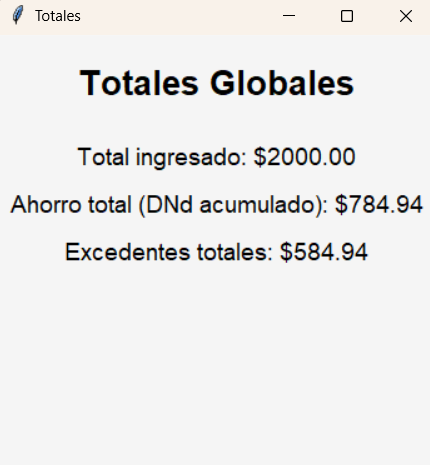
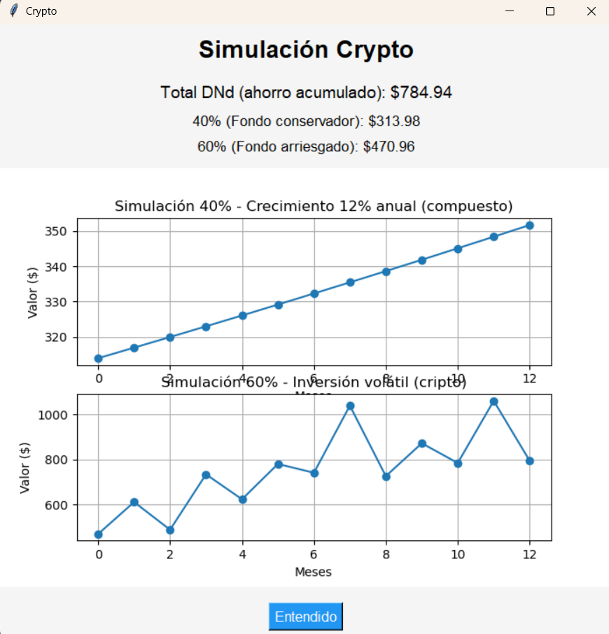

# Sistema de Gestión de Organización Financiera

Aplicación de consola desarrollada en Python para el control eficiente de ingresos y egresos personales. 

# Idea Clave

Lo que se busca con este programa es el permitir una mejor organización financiera en el ambito del ahorro. 
Permitiendo que el usuario, divida su ingreso, establezca un porcentaje claro y tenga un registro de gastos diarios que ayudaran a mantener el ahorro de forma constante. De igual forma se busca trabajar ese dinero que queda inmovil en el ahorro, se este moviendo en criptomonedas o valores en bolsa, que dejen un rendimiento extra buscando mejorar la forma de ahorro que ofrecen las entidades bancarias.

##  Características
* **Gestión Modular:** Código organizado en módulos para facilitar el mantenimiento.
* **Persistencia de Datos:** Uso de archivos externos (.txt/.dat) para guardar información permanentemente.
* **Validación de Datos:** Implementación de filtros para evitar errores de entrada del usuario.
* **Reportes:** Generación de balances financieros automáticos.

# Capturas del Programa

##  Tecnologías
* Python 3.x
* Manejo de flujos de archivos (I/O)
